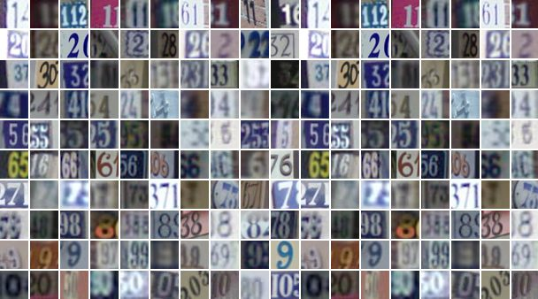

# Image Classifier for the SVHN Dataset

A multilayer perceptron and a convolutional neural network, both built with TensorFlow 2 / Keras, trained to read house-number digits from real-world street photos.


## Overview

This project goes through a complete image classification workflow on a dataset harder than MNIST:
load and preprocess real-world digit images, build two different classifiers, train them, read the
learning curves, evaluate them on unseen data, save the best weights and compare their predictions
side by side.

A convolutional network reaches **87.66% accuracy on the 26,032 test images**, close to 8 points above
a fully-connected network with five times as many parameters.

Everything lives in a single notebook: [`svhn-digit-recognition.ipynb`](svhn-digit-recognition.ipynb)

## Dataset



The [Street View House Numbers (SVHN)](http://ufldl.stanford.edu/housenumbers/) dataset, cropped
digits from real Google Street View photos:

|  |  |
|---|---|
| Training set | 73,257 images |
| Test set | 26,032 images |
| Image format | 32x32 RGB, pixel values 0-255 |
| Classes | the digits 0 to 9 (labelled `10` in the raw files for `0`) |
| Task | multi-class image classification |

Unlike MNIST, the digits sit inside cluttered, real-world scenes instead of a clean black background,
which makes SVHN a meaningfully harder benchmark. Preprocessing converts the RGB images to grayscale,
moves the image index to the first axis and scales pixel values to `[0, 1]`, so each image becomes a
`(32, 32, 1)` tensor.

## Models

Two classifiers are trained from scratch and compared under the same conditions (30 epochs, batch
size 128, 15% validation split, the same three callbacks).

### Baseline MLP

| Layer | Configuration | Params |
|-------|---------------|--------|
| `Flatten` | - | 0 |
| `Dense` + `BatchNorm` | 512 units, ReLU, L2 | 526,848 |
| `Dense` + `BatchNorm` | 256 units, ReLU, L2 | 132,352 |
| `Dense` + `BatchNorm` | 256 units, ReLU, L2 | 66,816 |
| `Dense` + `BatchNorm` | 128 units, ReLU | 33,408 |
| `Dense` + `BatchNorm` | 128 units, ReLU | 17,024 |
| `Dense` | 10 units, softmax | 1,290 |

**775,178 trainable parameters.**

### CNN

| Layer | Configuration | Output shape | Params |
|-------|---------------|--------------|--------|
| `Conv2D` | 32 filters 3x3, `padding="same"`, ReLU | (32, 32, 32) | 320 |
| `MaxPooling2D` | 2x2 | (16, 16, 32) | 0 |
| `Conv2D` | 16 filters 2x2, `padding="same"`, ReLU | (16, 16, 16) | 2,064 |
| `MaxPooling2D` | 2x2 | (8, 8, 16) | 0 |
| `Flatten` | - | (1024,) | 0 |
| `Dense` + `BatchNorm` + `Dropout(0.3)` | 128 units, ReLU | (128,) | 131,712 |
| `Dense` + `BatchNorm` + `Dropout(0.3)` | 128 units, ReLU | (128,) | 17,024 |
| `Dense` | 10 units, softmax | (10,) | 1,290 |

**151,898 trainable parameters** — about a fifth of the MLP.

Both models use the Adam optimizer and `sparse_categorical_crossentropy` as the loss function, and
are trained with `ModelCheckpoint` (best weights by validation loss), `EarlyStopping` (patience 10)
and `ReduceLROnPlateau` (factor 0.3) as callbacks.

## Workflow

1. **Load** — the `.mat` files read with `scipy.io.loadmat`.
2. **Explore** — random samples inspected before and after preprocessing.
3. **Preprocess** — grayscale conversion, axis reorder, `[0, 1]` scaling and the `10 -> 0` label fix.
4. **Build** — a fully-connected baseline and a small convolutional network.
5. **Train** — up to 30 epochs each, with checkpointing, early stopping and learning-rate decay.
6. **Learning curves** — training vs validation accuracy and loss, plotted per epoch.
7. **Evaluate** — both models scored on the 26,032 test images.
8. **Reload and compare** — weights reloaded from the saved checkpoints and predictions compared
   side by side on random test images.

## Results

| Model | Trainable params | Train accuracy | Val accuracy | Test accuracy | Test loss |
|-------|------------------:|----------------:|---------------:|----------------:|-----------:|
| MLP   | 775,178 | 87.19% | 82.50% | 80.06% | 0.8478 |
| CNN   | 151,898 | 88.03% | 89.21% | **87.66%** | **0.4066** |

Both models trained the full 30 epochs without early stopping triggering; the learning rate was cut
several times by `ReduceLROnPlateau` on each as validation loss flattened out.

## Key takeaways

- **Convolutions win by a wide margin.** With roughly a fifth of the parameters of the MLP, the CNN
  scores about 7.6 points higher on the test set. SVHN's cluttered, real-world backgrounds punish a
  fully-connected model, which throws away the spatial structure a convolution is built to exploit.
- **The MLP overfits more.** Its 87.19% training accuracy sits close to the CNN's 88.03%, but its
  test accuracy falls 2.44 points short of its own validation accuracy, a bigger generalisation gap
  than the CNN shows (89.21% val vs 87.66% test, a 1.55 point gap).
- **Checkpointing paid off.** Reloading each model from its saved `.weights.h5` file reproduces the
  exact same test metrics obtained right after training, confirming the best epoch was the one kept.
- **SVHN is a harder benchmark than MNIST.** Even the better of the two models here, at 87.66%,
  falls well short of the >98% a similar-sized network reaches on MNIST — a direct consequence of
  the cluttered backgrounds and varied digit styles in real street photos.

## Project structure

```
.
├── data/                              # Sample image used in the notebook (the .mat files are not tracked)
├── checkpoint_MLP/                    # Best MLP weights saved during training
├── checkpoint_CNN/                    # Best CNN weights saved during training
├── src/tf2_svhn_digit_recognition/    # Package scaffold
├── svhn-digit-recognition.ipynb       # Main notebook
├── pyproject.toml                     # Dependencies (uv project)
└── uv.lock                            # Pinned versions
```

## Getting started

The project is managed with [uv](https://docs.astral.sh/uv/) and requires Python 3.11+.

```bash
# Clone the repository
git clone https://github.com/ramirezgrosas/tf2-svhn-digit-recognition.git
cd tf2-svhn-digit-recognition

# Create the virtual environment and install the dependencies
uv sync
```

Then open the notebook in VS Code and select `.venv` as the kernel, or launch Jupyter directly:

```bash
uv run --with jupyter jupyter lab
```

The dataset is **not** downloaded automatically: download `train_32x32.mat` and `test_32x32.mat`
from the [SVHN website](http://ufldl.stanford.edu/housenumbers/) (Format 2: Cropped Digits) and
place them under `data/` before running the notebook.

Main dependencies: TensorFlow 2.21 (Keras 3.15), NumPy, pandas, scikit-learn and SciPy.

## Possible improvements

- Train on the RGB images directly instead of converting to grayscale, since colour can help
  separate a digit from its background.
- Add data augmentation (small rotations, translations, brightness jitter) to help both models
  generalise to the variety of real-world photos in SVHN.
- Try a deeper CNN with more filters, the usual way to close more of the remaining gap to
  clean-dataset accuracy.
- Build a confusion matrix to find out which digits the CNN still confuses most often.

## Author

**Diego Ramírez Rosas** — [ramirezgrosas](https://github.com/ramirezgrosas)
